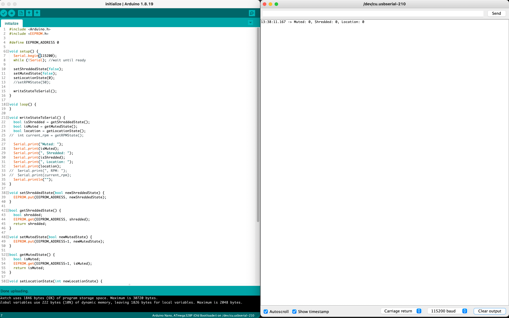

# Kinetic Shredder Frame Kit Assembly Instructions

### Prerequisites
Ensure that you have all of the parts and tools on hand before continuing.

- [Parts](PARTS_LIST.md)
- [Tools](TOOLS_LIST.md)

## 1. Assemble the PCB chassis
Use the included 3D printed jig to position the PCB pieces so their corners meet at a 90 degree angle.

### Tools Required
- 90 Degree Jig
- Soldering Iron
- Solder (thick rosin core)

### Parts Needed
- "Left" PCB
- "Right" PCB
- "Top" PCB
- "Bottom" PCB
- Lateral Support PCBs (x3)

### Steps
- The PCBs come in two panels. Break them apart carefully into their constituent pieces.
- Join the "Left" and "Top" PCB pieces first.
    - Place both pieces in the jig so that the sides marked "Front" are facing the same direction.
    - Carefully bring the corners together so that the tabs interlock and fit together with no gaps and a nice 90 degree angle is achieved.
    - The silver metal strips should be facing each other on in the inside of the corner.
    - Cut a piece of rosin core solder and lay it in the corner on the silver metal strips.
    - Use your soldering iron to melt the solder to join the "Left" and "Top" PCB pieces together.
    - Let it cool before attempting to remove from jig.
- Join the "Left" and "Bottom" PCB pieces
- Join the "Right" and "Top" PCB pieces
- Join the "Right" and "Bottom" PCB pieces
- Install the three lateral support pieces
    - Start with the middle support
    - Use a pice of tape to hold the "Left" and "Right" PCB pieces at the correct distance so that the ends of the middle support are flush with the exterior
    - solder both sides and let cool
    - flip over, solder both sides again and let cool
    - Repeat for the top and bottom lateral supports

## 2. Install the eyelet
The eyelet is used as a pulley of sorts for the fishing line that will hold the pre-shredded image within the chassis.

### Tools Required
- Pliers
- Soldering Iron
- Solder (thin rosin core)

### Parts Needed
- Eyelet
- Chassis

### Steps
- Install the small eyelet into the hole located at the center rear of the "Top" PCB piece.
- The eyelet is fragile and can easily break, so don't screw it in more than one or two turns. Just enough so that it stays in place. It should NOT need to poke through the top. 
- Orient the eyelet hole so that it's facing front & back. 
- Use a dab of solder on top & bottom to secure it in place.

## 3. Solder the Electronics
Install and solder all of the electronic components on the PCB labeled "Right". Be sure to pay attention to the orientation of each component to ensure the pins and polarity are correct.

### Tools Required
- Soldering Iron
- Solder

### Parts Needed
- Arduino
- Stepper Motor Driver (A4988 or TMC2209)
- 5V Buck Converter
- 4-pin Header
- IR Receiver
- Piezo Buzzer
- 100uf 16v Capacitors (x2)
- Barrel jack
- Stepper Motor Pigtail

### Steps
- Arduino 
- Stepper Motor Driver 
- Active Piezo Buzzer 
- Capacitors 
- 12V Barrel Jack
- 4-pin Header
    - Buck Converter goes onto 4-pin Header
    - When oriented correctly, should hang downwards
    - EN pin does not connect to anything
- IR Receiver
- Stepper Motor Pigtail
    - From left to right (front to back): Red, Blue, Green, Black
    - DO NOT INSTALL THE STEPPER MOTOR ITSELF YET

## 4. Construct the Rollers
The rollers are made from aluminum tubing and some heat shrink to make a rubberized surface for better grip. Bearings and a motor mount are used in the ends.

### Tools Required
- Heat Gun or Hair Dryer
- Epoxy/JBWeld/Silicone/Glue (optional)

### Parts Needed
- Aluminum Tubes (x2)
- Heat Shrink Tubing (x2)
- Flanged Bearings (x3)
- Motor Mount

### Steps
- Apply heat shrink to both tubes
    - Place an aluminum tube through a piece of heat shrink tubing. There should be a little overhang at each end.
    - Use a heat gun or blow dryer to shrink the tubing onto the tube until it's uniformly tight and smooth
    - Cut the excess tube overhanging the ends so that it is flush with the ends
- Top Roller
    - Pick one roller to be the top roller. It doesn't really matter which one as they are the same length. 
    - Insert a flanged bearing into one end, and the motor mount into the other
    - Ensure you press them all the way on and check that they fit tightly
    - If they don't fit tightly you can use some epoxy, silicone, or glue, but this is optional.
- Bottom Roller
    - Install a flanged bearing into each end. 
    - If they don't fit tightly and fall out easily you can use some silicone, or epoxy, or any kind of glue really.
- If you used some sort of glue, let it dry thoroughly before continuing.

## 5. Install rollers, canvas belt, and motor
You need to install the rollers, canvas belt, and motor all at the same time.

### Tools Required
- 1.5mm allen wrench
- Tweezers (optional)

### Parts Needed
- Top Roller Assembly
- Bottom Roller Assembly
- Canvas Artwork Belt
- Stepper Motor
- Roller Mounting Pins (x3)
- 1.5mm button head screws (x4)
- Rubber Bands (x4)

### Steps
- Place the chassis on a flat surface with the side marked "Front" facing up towards you.
- Place the artwork canvas belt in the frame with the image facing up and centered vertically in the chassis
- Place the top and bottom rollers inside the top and bottom of the canvas belt
- Insert the bottom roller mounting pins through the bottom slot and into the bearing holes on each side
    - The pins should snap into place and stay retained within the slot
- Insert the stepper motor through the chassis and into the motor mount on the right side of the top roller. Ensure the flat side of the hole lines up with the flat side of the motor shaft 
    - You can insert a screw or two to keep the motor in place but don't tighten fully yet
- Insert the remaining roller mounting pin on the left side of the top roller
    - This pin should snap into place as well, however it can take more effort. Be careful not to push too hard on the PCB frame during this part. Try to keep pressure between the back of the motor, tube, and mounting pin only.
- Install and tighten the remaining screws to hold the motor in place.
- Install a couple of rubber bands on each side of the lower roller to provide some tension. You can add more later if needed.
    - Use a pair of tweezers from behind to get the rubber bands on if you're having trouble.

## 6. Program Arduino
Now lets program the arduino and test that everything is working so far.

### Tools Required
- Computer
- Arduino IDE
- USB cable

### Parts Needed
- Chassis with electronics fully soldered

### Steps
- Download the [initialize.ino](arduino/initialize/initialize.ino) file
- Open the **initialize.ino** file in the Arduino IDE
- Plug the Arduino into your computer via USB
- In the Arduino IDE:
    - Click *Tools* | *Board* | *Arduino AVR Boards* | ***Arduino Nano***
        - You may need to add the board first via the *Boards Manager*
    - Click *Tools* | *Processor* | ***ATmega328P (Old Bootloader)***
    - Click *Tools* | *Port* | ***\<Select the Serial Port for your Arduino>***
    - Click *Tools* | ***Serial Monitor***
        - If port connection is successful a serial monitor window should open
    - Click the ***Verify*** button on the code window toolbar
        - Continue when you see a "Done Compiling" message at the bottom
    - Click the ***Upload*** button on the code window toolbar
        - This will start the process of programming the Arduino
        - When done you should see a message on the Serial Monitor that says something like:
            - **Muted: 0, Shredded: 0, Location: 0**
        - If you see this message, that means that you successfully connected to and programmed the Arduino Nano using the initialize.ino file. This file initializes and persists the starting state of the shredder frame to the internal flash storage.
        - If you get an error, double-check everything and try again.
- Download the .ino file for the stepper motor driver in your kit
    - [A4988](arduino/kinetic_shredder_A4988/kinetic_shredder_A4988.ino)
    - [TMC2209](arduino/kinetic_shredder_TMC2209/kinetic_shredder_TMC2209.ino)
- Open the A4988 or TMC2209 .ino file in the Arduino IDE 
    - Click the ***Verify*** button on the code window toolbar
        - Continue when you see a "Done Compiling" message at the bottom
    - Click the ***Upload*** button on the code window toolbar
        - This will start the process of programming the Arduino
        - You will overwrite the previous initialize.ino code, but the state you persisted to flash will remain intact
        - When done you should see a message indicating that it is running and also show you the current state again.
        - If you see this message, great job. We are done with the programming. Unplug everything for now and move on to the next step.

### Testing
- Leave the USB cable connected so you can see the Serial Monitor output while testing
- Plug the 12V power adapter into the wall and barrel connector
- Point the IR Remote at the IR Receiver and press OK
- The chassis should start moving and beeping, and you should see messages in the Serial Monitor indicating the command received and the action taking place: `runMainSequence`
- Let the main sequence finish.
- Make sure the canvas returned to it's original position.
    - If it slipped while the motor was moving, try adding/removing rubber bands to adjust the tension until it becomes reliable.

## 7. Assemble the fishing line, hanger, and separator.
The fishing line assembly connects the canvas belt to the hanger holding the pre-shredded image and functions as the mechanism for lowering and raising the shredded image hidden within the chassis.

## Tools Required
- Tape (painters or scotch)

## Parts Needed
- Fishing Line
- Swivel Hooks (x2)
- Hanger (3D printed)
- Separator (12x16 art board)

## Steps
- Ensure the canvas belt is positioned so that the artwork is precisely centered for display on the side marked "Front".
- Flip the chassis over so that the side marked "Back" is now facing up
    - The seam on the back of the canvas should be located about a third of the way down on the backside
- Tie one end of the fishing line to one of the swivel hooks. 
    - Ideally, use the knot shown in this [video](https://youtu.be/5vUI_ly1z8k?si=L20prei8CbNu0pxN&t=65)   
- Connect the latching hook part of the swivel hook to the loop located at the seam of the canvas belt. Lock the hook.
- Latch the other swivel hook to the hole on the top of the hanger.
- Thread the open end of the fishing line through the eyelet on the "Top" PCB and through the end of the other swivel hook connected to the hanger.
- Ensuring that the canvas belt has not moved, tie the open end of the fishing line to the other swivel hook in the same fashion as before.
    - The swivel hook and hanger should end up as far up as possible without the swivel hook going through the eyelet at the top.
- Flip the hanger up and over the "Top" piece so it is out of the way for the next step
- Lay the separator art board down across the lateral supports so that it is all the way up as far as it can go. Ensure the cutaway at the top allows the fishing line to pass through unobstructed.
- Secure the separator board using some painters or scotch tape.
- Flip the hanger back down on top of the separator

### 8. Mount the pre-shredded art copy

## Tools Required
- None

## Parts Needed
- Chassis assembly with hanger ready
- Pre-shredded Artwork

## Steps
- Remove the top piece of the hanger and place the pre-shredded artwork onto the hanger so the two prongs go through the two holes at the top of the artwork. 
- Reinstall the top piece of the hanger so that it snaps on and holds the artwork securely.
- Adjust the position of the canvas belt & hanger so they are in their starting position.
- The pre-shredded artwork should NOT hang past the bottom of the chassis when the canvas belt is in the starting position. It should be just above the bottom of the chassis.
- You may need to re-tie the fishing line to adjust the relative positions of the canvas belt and pre-shredded artwork to get it just right.

### 9. Mount to 12 x 16 Picture Frame
Use the included Z-clips to attach the fully assembled chassis to any 12 x 16 wood frame with at least 1.5" wide moulding.

## Tools Required
- Philips screw driver

## Parts Needed
- Z-Clips
- Hanger Wire
- Screws

## Steps
- Be sure to center canvas belt both vertically and horizontally withing the chassis.
- Be sure to center the entire chassis on the picture frame so that everything looks good when viewing from the front.
- Install the Z-Clips using the slots in the side of the chassis
- Install the hanger wire onto the wooden frame. Be sure to hang from the picture frame, not the PCB chassis.
- Picture frame is hung from the wall, PCB chassis it mounted to the picture frame.
- You can optionally install a backing piece if you'd like but this is not necessary.